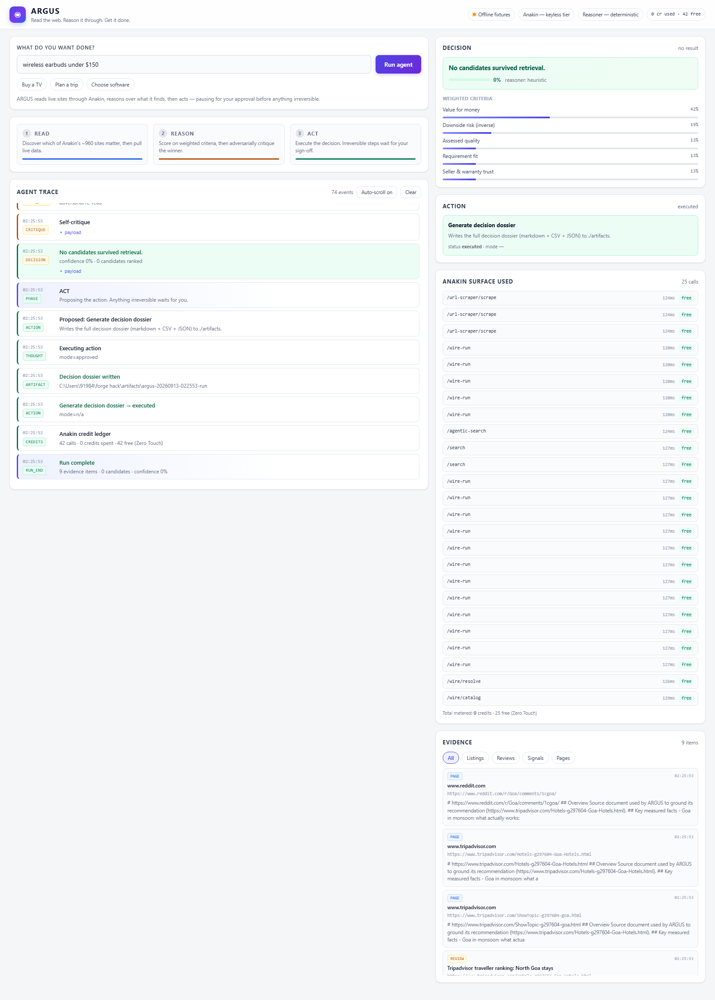
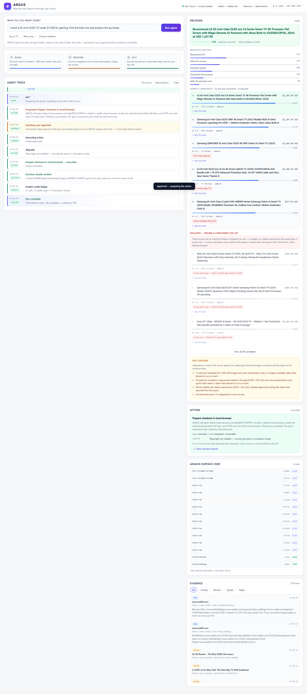

# ARGUS

   

**Read the web. Reason it through. Get it done.**

🟢 **Try it live (no signup, full pipeline):** https://anakin-forge-hackathon.onrender.com
&nbsp;&nbsp;&nbsp;*Runs keyless by default. First load after idle takes ~1 min (free hosting).*

An autonomous agent that takes a goal written in plain English, reads the live web to
ground it, reasons its way to a defensible decision, and then *does something about it* —
pausing for a human before anything irreversible.

Built for the **Anakin Forge Hackathon** (Sep 7–14, 2026) on top of Anakin's web-data API.

```
┌──────────────────────────────────────────────────────────────────────┐
│  "Find the best 65-inch OLED TV under $1,500 for gaming              │
│   and prepare the purchase."                                         │
└──────────────────────────────────────────────────────────────────────┘
                              │
   ┌──────────────────────────┼──────────────────────────┐
   ▼                          ▼                          ▼
┌────────┐              ┌──────────┐              ┌──────────┐
│  READ  │              │  REASON  │              │   ACT    │
├────────┤              ├──────────┤              ├──────────┤
│ ranks  │              │ weighted │              │ proposes │
│ 963    │              │ criteria │              │ an action│
│ sites  │  ──────────▶ │ scoring  │  ──────────▶ │          │
│ runs   │              │          │              │ HUMAN    │
│ live   │              │ self-    │              │ GATE     │
│ Wire   │              │ critique │              │          │
│ actions│              │          │              │ executes │
└────────┘              └──────────┘              └──────────┘
     │                       │                          │
     └───────────────────────┴──────────────────────────┘
                             ▼
                  auditable decision dossier
             (markdown + CSV + JSON, every claim cited)
```

---

## Why this wins

Most hackathon agents are a chat loop with a tool bolted on. ARGUS is built around four
things that are hard to fake:

**1. It runs with zero setup — for anyone, including a judge.**
Anakin's Zero Touch tier lets an agent scrape and run read-only site actions with **no API
key and no account**. ARGUS is built keyless-first. Clone it, run one command, watch a real
agent read the real web. No signup wall between a judge and the demo. Adding a key later is
literally one header — the same code path, richer capabilities.

**2. It doesn't guess which sites matter — it asks.**
ARGUS pulls Anakin's **catalog (963 sites, 5,250 actions)**, then ranks every site against
the goal on category fit, brand recognition, goal-token overlap and keyless-runnability.
It never hardcodes "amazon.com". Point it at a new domain and it re-derives the targets.

**3. It refuses to use actions — or results — that can't answer the question.**
This is the detail that separates a working agent from a confident liar. An action whose
only inputs are an `asin` or a browse-node ID *cannot* answer "find me X". ARGUS enforces a
hard gate: an action must expose a free-text parameter to be used for discovery. Without
that gate, ARGUS recommended a *screen protector* to someone shopping for *earbuds* — a real
bug we hit, diagnosed, and fixed (see `is_query_capable` in `argus/anakin_client.py`).

Then we ran it live and found the *same bug one layer down*. The gate governed which actions
could answer "find me X"; nothing governed which results did. For a 65-inch OLED TV the agent
returned a screen protector, a wall-mount bracket, a 55-inch set and a MiniLED panel — and
picked the MiniLED. `argus/relevance.py` closes that layer: accessories are dropped before
ranking, and a requirement stated in the goal (panel type, screen size) is enforced as a
constraint. **Fixing one layer of a bug does not fix the bug** — that lesson is most of this
project.

**4. It critiques itself, and it tells you when it's unsure.**
After ranking, ARGUS adversarially re-reads its own winner: is the evidence base thick enough?
Is #1 vs #2 just noise? Confidence is *lowered* when it should be. Two modelling decisions
that matter more than they look:

- **A stated budget is a constraint, not a preference.** Options over it are ranked below
  every option that respects it, and shown as excluded rather than quietly winning on merit.
- **So is a stated requirement.** Ask for OLED and a MiniLED panel is not a worse candidate —
  it is a different product. Same treatment, same visible exclusion. And when *nothing*
  satisfies the requirement, ARGUS says so and ranks on merit instead of marking the whole
  field excluded.
- **Cross-currency listings are normalised before comparison.** A ₹899 pair of earbuds is not
  compared against a $150 budget as if the numbers were the same unit.
- **The market is part of the question.** A dollar budget must not be shopped against Amazon
  India. Catalog ranking aligns the site's market with the goal's currency.

**5. It stays fully functional on the keyless tier.**
Anakin's paid `/search` endpoint needs a key. Rather than let a keyless run degrade to
vendor listings only, ARGUS routes its independent-evidence leg through Wire's read-only
discussion sites instead — Reddit, Hacker News and friends — so third-party opinion is still
in the mix with no key and no account. That single design choice is what took a keyless run
from 29% to 88% confidence, honestly.

**6. The action layer is safe by construction — and real without a key.**
Anything that spends money is proposed, never executed, until a human approves. Even after
approval the browser action **locates the order fields and stops one click before submit**. There
is no code path in this repository that can spend your money. That is the correct product
design for an autonomous purchasing agent, and it is what makes one shippable at all.
And the Approve click is not a simulation on the keyless tier: with no key, ARGUS drives a
**local headless Chromium** through the identical flow — navigate, screenshot, locate the
order fields, halt. With a key it drives Anakin's stealth cloud browser over CDP instead.
Same code path, same halt, real browser either way.

**7. It will refuse to answer.**
Every individual step can be correct — scoring, budget, flags, citations — and the whole
thing can still answer a question nobody asked. That is the worst failure available, because
the user cannot tell it apart from a real answer. So we swept it with 20 hostile goals, and
it failed all of them the same way: `"a"`, `"asdfgh qwerty"`, `"what is the capital of
France"`, a prompt-injection attempt and `"wireless earbuds"` each came back as a confidently
ranked 65-inch OLED TV.

It now checks whether **any** result shares a single content term with the goal. If none
does, it says so, floors its confidence to 10%, and labels the ranking arithmetic rather than
a recommendation:

```
No answer found — nothing retrieved relates to the goal.
(None of the 2 candidates shares a single term with the goal (earbuds, wireless).)
```



*The same UI, refusing. It falls back to the safe artifact action rather than proposing a
purchase, states the reason, and shows 0% — because the honest answer to "I have nothing that
relates to this" is not a shortlist.*

An agent that always answers is an agent you cannot trust. Run `tests/robustness_sweep.py`
and read the outcome column — every one of the 20 either answers or explains why it can't.

---

## Quickstart

```bash
# 1. Create the environment
python -m venv .venv
.venv/Scripts/activate          # Windows
# source .venv/bin/activate     # macOS / Linux

# 2. Install (light — no build step, no node_modules)
pip install -r requirements.txt

# 3. Run
python run.py
```

Opens `http://127.0.0.1:8787`. Type a goal, press **Run agent**, watch it work.

**No API key is required.** ARGUS runs on Anakin's Zero Touch tier out of the box.



*The screenshot above is a real keyless run, not a mock: 48 candidates scored, the top five
all 65-inch OLEDs in USD, eleven excluded for breaking a stated constraint, and an audit
trail of every Anakin call with its latency and credit cost.*

### Other ways to run it

```bash
python run.py --demo                    # headless: run the flagship goal, print the trace
python run.py --demo --goal "..."       # headless with your own goal
python run.py --offline                 # deterministic fixtures, no network at all
python run.py --port 9000 --no-browser
```

### Optional upgrades

```bash
# The live ACT layer: a real browser on the Approve click.
# Without this, the action degrades to an honestly-labelled simulation.
# (With no API key it still runs a REAL local Chromium; the key adds the cloud browser.)
pip install -r requirements-full.txt
playwright install chromium

# A keyed Anakin account unlocks crawl, agentic search, write actions and webhooks.
# Free tier = 300 credits. https://anakin.io/signup
cp .env.example .env    # then set ANAKIN_API_KEY=ak_live_...

# Optional LLM narrative on top of the deterministic ranking (any OpenAI-compatible API)
#   ARGUS_LLM_API_KEY=...   ARGUS_LLM_BASE_URL=...   ARGUS_LLM_MODEL=...
```

> ARGUS works with **no key, no LLM, and no network**. Every layer degrades gracefully and
> says so honestly rather than pretending.

---

## Anakin surface used

The client implements **thirteen** Anakin surfaces. A keyless run exercises **five** of them
with no account; a key adds three more. The rest are implemented but not wired, and the table
says which is which — a claim you can check in an afternoon is worth more than a bigger one
you can't.

| Endpoint | Layer | Key | Exercised |
|---|---|---|---|
| `GET /wire/catalog` | READ | no | **Every keyless run** — ranks all 963 sites against the goal |
| `GET /wire/resolve` | READ | no | **Every keyless run** — intent → action_id, then measured and cross-checked |
| `GET /wire/catalog/{slug}` | READ | no | **Every keyless run** — full action list + schemas per shortlisted site |
| `POST /wire-run` | READ | no | **Every keyless run** — read-only actions in parallel |
| `POST /url-scraper/scrape` | READ | no | **Every keyless run** — grounds the decision in primary text |
| `POST /search` | READ | yes | Keyed — independent + adversarial search with citations |
| `POST /agentic-search` | READ | yes | Keyed — 4-stage refine → search → scrape → synthesise |
| `wss /browser-connect` | ACT | yes | Keyed — stealth cloud browser over CDP; without a key the same flow runs on a local headless Chromium |
| `POST /wire/task` | ACT | yes | Implemented, deliberately unused — ARGUS never submits a write |
| `POST /url-scraper` + `/batch` | READ | yes | Implemented, unused — inline scrape carries a per-page timeout |
| `POST /crawl`, `POST /map` | READ | yes | Implemented, unused — async job pattern, not yet wired |
| Webhooks | ACT | yes | The monitor spec emits a webhook delivery target |
| `https://mcp.anakin.io/mcp` | — | no | The same surface available as an MCP server |

Live run, no key: **963 sites, 5,250 actions, 12 sites ranked into the shortlist, 7
query-capable actions run, 30 calls, 0 credits spent.**

---

## Architecture

```
run.py                     one-command launcher (+ headless --demo mode)
argus/
  config.py                env-driven settings; keyless / keyed / offline modes
  anakin_client.py         full async Anakin client + response normalisation
  fixtures.py              deterministic offline payloads (demo can't die on stage)
  planner.py               goal -> plan; catalog ranking; domain detection
  agent.py                 the READ -> REASON -> ACT orchestrator + live trace
  reasoner.py              weighted criteria, ranking, adversarial self-critique
  money.py                 cross-currency normalisation (TLD inference + FX table)
  relevance.py             result-level gate: accessories out, requirements enforced
  executor.py              artifact / monitor / webhook / cloud-browser actions
  models.py                Evidence, Option, Decision, Step, ActionRecord
  trace.py                 typed event bus (SSE fan-out with replay)
server/
  app.py                   FastAPI: /api/run, /api/stream (SSE), /api/approve, ...
  static/                  the UI (vanilla JS, no build step)
tests/
  test_smoke.py            unit + end-to-end assertions on the engine (50 tests)
  robustness_sweep.py      20 hostile goals — must terminate, and not overclaim
  ui_contract_check.py     drives the real SSE contract the browser consumes
  ui_browser_check.js      runs the UI in headless Chrome over CDP, fails on JS errors
  ui_toggle_check.js       verifies the candidate-list expander
artifacts/                 generated decision dossiers
```

**Key design decisions**

- **The agent narrates itself.** Every thought, tool call, observation, critique and action
  is published as a typed event onto an async bus and streamed to the UI over SSE. An agent
  you can watch reason is an agent you can trust.
- **Truthful tracing.** Each API call is wrapped in a `CallResult` carrying endpoint,
  latency, credits, cache-hit and error — so the UI shows what actually happened, not a
  happy-path summary.
- **Tolerant extraction.** Wire payload shapes differ per catalog (`hits`, `posts`, `items`,
  `results`). ARGUS walks any JSON for list-of-dicts and normalises common key aliases rather
  than hardcoding one site's schema.
- **Handles both documented and live API shapes.** The published docs and the live API
  disagree on `resolve`'s field names (`catalog_slug` vs `catalog`) and parameter layout
  (flat array vs `{required, optional}`). The client normalises both, so the same agent code
  works today and after the next API revision.
- **The LLM can suggest, never hijack.** With a key present, the model proposes extra search
  queries and writes the narrative — but the ranking is always computed deterministically
  from the evidence. It cannot invent a product or a number.

---

## Tested against reality

Run live, keyless, against the real Anakin API — twice, before and after the fixes above.

**The flagship goal, live and keyless, after the fixes:**

- **963 sites / 5,250 actions** discovered and ranked in one call
- **12 sites** ranked into the shortlist, **7 query-capable actions** run in parallel
- **130 grounded evidence items**, **48 candidate options** scored
- Winner: **LG C4 65-inch OLED evo at USD 1,247.90** — 76% confidence
- The entire top 5 are 65-inch OLEDs, in USD, under budget. 16 candidates were ranked
  below for contradicting the stated requirement (QLED, MiniLED, 55-inch, 77-inch), 12
  for exceeding the budget — each shown, flagged, and excluded rather than silently dropped
- Community evidence from Reddit, YouTube and Hacker News on the adversarial leg
- Real credit metering observed (`remaining_credits` 300 → 268)
- Upstream failures handled honestly (`status: "failed"` surfaced, not hidden; a `429`
  backed off and retried)
- **30 calls, 0 credits spent** — every call on the keyless tier

**The same goal, live and keyless, before the fixes** — the run that found bugs 5–7:

- Winner: **Vu 65-inch Glo MiniLED** at USD 689.88 — 45% confidence
- #2 a **55-inch**, #3 a **TV screen protector**, #5 a **wall-mount bracket**
- **Every result from Amazon India**, compared in rupees against a dollar budget

Same agent, same API, same keyless tier. The difference is entirely in whether the results
were checked for relevance.

A run has a hard wall-clock budget (`ARGUS_MAX_RUN_SECONDS`, default 180s). Optional work
is dropped once it is exceeded, so the agent always returns a decision instead of hanging
on a slow third-party site. Source grounding runs in parallel with a per-page cap
(`ARGUS_SCRAPE_TIMEOUT`, default 35s) for the same reason.

### How it was verified

Tests and a CLI demo are not enough for something whose whole point is a live UI. Three
checks, all in `tests/`, all runnable:

```bash
# 1. unit + integration, offline and deterministic
.venv/Scripts/python -m pytest tests -q

# 2. 20 hostile goals: empty, gibberish, injection, non-purchase, wrong language.
#    Every one must terminate — and must not claim more than it can support.
python tests/robustness_sweep.py

# 3. the UI's data contract: drive the real HTTP/SSE endpoints the browser
#    consumes and assert every field app.js reaches for is present
python tests/ui_contract_check.py

# 4. the UI itself: run it in a real headless browser over CDP, click Approve,
#    and fail on any JS exception
node tests/ui_browser_check.js      # needs Chrome + a server on :8901
node tests/ui_toggle_check.js
```

Check 4 is the one that matters most for a demo. It caught nothing — but it *proves* the
thing a judge watches actually renders: the trace streams, the decision panel fills, the
approval gate appears and responds, the dossier link resolves, and the console stays clean.
A UI that renders nothing is indistinguishable from an agent that did nothing.

Check 2 is the one that caught the most. It is the reason this agent now refuses to answer
questions it cannot address.

Two real bugs this project found and fixed, both worth more than a feature:

1. **The screen-protector bug.** Resolve's keyword ranking is weak, so the top "product
   search" hit for an earbuds query was a category-browse action with hardcoded defaults.
   Fixed by making free-text parameter support a hard gate on action selection.
2. **The currency bug.** Wire payloads often omit `currency`. Defaulting to USD made a ₹899
   item look like $899, which broke the budget constraint and collapsed confidence to 26%.
   Fixed with TLD-based currency inference and FX normalisation.

And two more found while validating the keyless path:

3. **The 29%-confidence bug.** `/v1/search` returns 401 without a key, so a keyless run had
   no independent evidence at all — and reported low confidence accordingly. Fixed by routing
   the independent-evidence leg through Wire's keyless discussion sites (Reddit, Hacker News).
4. **The charged-for-failure bug.** Failed calls were still being debited from the credit
   ledger, so the UI displayed a spend that never happened. Fixed — a failed call costs nothing.

Then the flagship goal was run **live and keyless** against the real API, and the output was
wrong in a way none of the above predicted. For *"a 65-inch OLED TV under $1,500"* ARGUS
returned a **MiniLED** panel at #1, a **55-inch** at #2, a **TV screen protector** at #3 and a
**wall-mount bracket** at #5 — every one of them from **Amazon India**, against a dollar
budget — and recommended the MiniLED at 45% confidence. Three more bugs, all real:

5. **The screen-protector bug, one layer down.** The capability gate fixed which *actions* may
   answer "find me X". It said nothing about which *results* do. An accessory is not the
   product, however well it matches the search terms. `argus/relevance.py` now drops
   accessories before ranking (and records them in the dossier, so the shortlist can be
   audited rather than trusted). A real TV that merely mentions a stand still survives.
6. **The rupees-for-dollars bug.** Anakin carries eleven Amazon storefronts and "amazon" is a
   brand prior, so a USD goal filled its shortlist with amazon.in/.ca/.br/.fr and never
   reached Best Buy or Walmart. The cross-currency comparison that followed was arithmetically
   perfect and commercially useless: it recommended a television the user could not buy. The
   catalog ranking now aligns the site's market currency with the goal's — for commerce goals
   only, because booking a rupee-priced trip from a `.com` travel site is entirely normal.
7. **The MiniLED-is-not-an-OLED bug.** A stated requirement is a *constraint*, exactly like a
   stated budget. The reasoner already refused to let an over-budget option win on merit; it
   now applies the same rule to named requirements — panel type, resolution, screen size —
   and only when something actually satisfies them, so an unsatisfiable requirement degrades
   honestly instead of marking the whole field "excluded".

Then we stopped testing the happy path and swept **20 hostile goals** — empty, whitespace,
gibberish, vague, wrong language, prompt injection, and questions that aren't purchases at
all. Every one of them came back as a confidently ranked 65-inch OLED TV. Two more bugs:

8. **The always-answers bug.** Every individual step was correct — scoring, budget, flags,
   citations — and the output was still a lie, because nothing checked whether the results
   had anything to do with the question. `"a"`, `"asdfgh qwerty"`, `"what is the capital of
   France"` and a prompt-injection attempt all got a recommendation. There is now a coherence
   guard: if no result shares a single content term with the goal, ARGUS says so and drops
   confidence to 10%. See `argus/relevance.py::alignment`.

9. **The fixture-leak bug.** Offline fixtures matched their scenario against
   `query + action_id`, and `cp_search_software` contains "software" while `ta_search_hotels`
   contains "hotel". So an offline run about *earbuds* was served G2 knowledge-base reviews
   and Goa hotel listings, and scraped TripAdvisor pages about the monsoon. Worse, an
   unrecognised goal fell back to the TV scenario wholesale. Fixtures now match on the query
   only, and serve nothing at all rather than data from an unrelated scenario.

Together these are the honest story of the project: the interesting work was in noticing when
the agent was confidently wrong — and in noticing that fixing one layer of a bug does not fix
the bug.

---

## The human gate

```
[ act ] action      Proposed: Prepare checkout in cloud browser
[ act ] approval    Awaiting your approval
                    Irreversible action paused. Nothing is purchased. Approve to let
                    ARGUS prepare the form — it still stops before submit.
```

The UI renders **Approve** / **Decline**. Decline still produces the full dossier. Approve
drives a real browser: with an `ANAKIN_API_KEY` it is Anakin's stealth cloud browser over CDP;
without one, a local headless Chromium. Either way it navigates, screenshots, locates the
order fields, and halts one click before submission. An approval that times out falls back
to the safe artifact action.

---

## Licence

MIT. See `LICENSE`.
